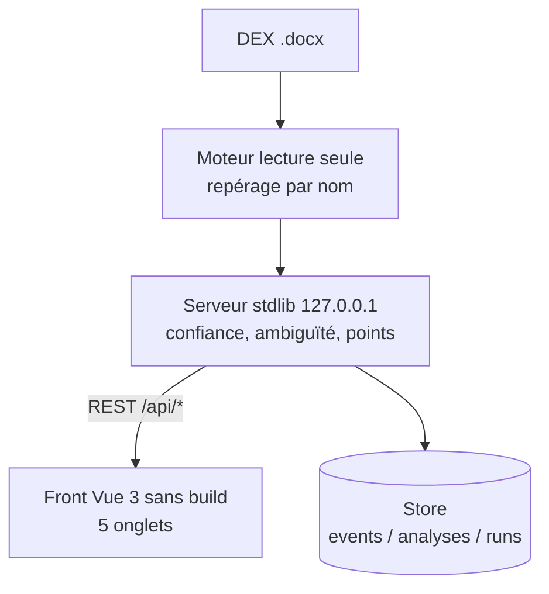
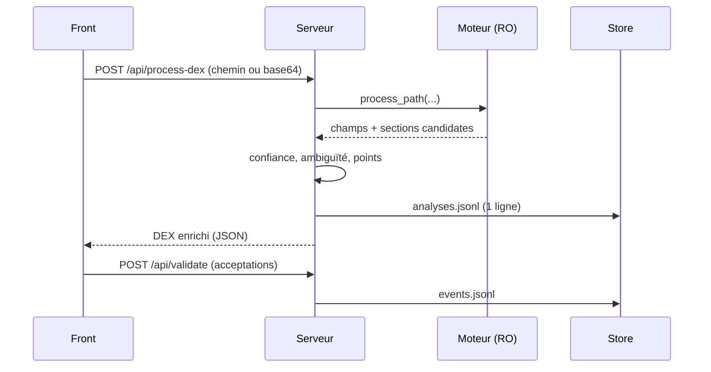

  managers   -
# Prise en main — Guide technique (managers)

*Vue technique de l'outil : architecture, règles de repérage, modèle de confiance, API,
déploiement et tests. Destiné à un public à l'aise avec l'informatique.*

---

## 1. Positionnement

Outil **mono-poste** d'aide à la reprise **manuelle** de DEX (Word `.docx`) vers
l'application web **CAST'IN**. Il **n'y a pas d'API CAST'IN** : l'outil produit un repérage
assisté (contenu + confiance + points à vérifier), la saisie reste humaine.

Contraintes structurantes : **zéro dépendance** (Python *stdlib* + Vue 3 *global* sans
build), **contenu jamais reformulé** (règle R7), **déterminisme**, **127.0.0.1** (rien ne
quitte le poste), **accessibilité RGAA/WCAG/DSFR**.

---

## 2. Architecture

```
   DEX .docx
      |
      v
  +--------------------------------------+
  |  MOTEUR  (lecture seule)             |   dex_castin_common.py / _cli.py
  |  - lit le document                   |
  |  - repère 23 champs PAR LEUR NOM     |
  |  - extrait le contenu, propose des   |
  |    sections candidates               |
  +--------------------------------------+
      |  (importé, jamais modifié)
      v
  +--------------------------------------+
  |  SERVEUR  (HTTP stdlib, 127.0.0.1)   |   dex_castin_server.py
  |  - enrichit : confiance, ambiguïté,  |
  |    points à vérifier, candidats      |
  |  - config, calibration, historique   |
  |  - Store : events / analyses / runs  |
  +--------------------------------------+
      |  REST /api/*  (JSON)
      v
  +--------------------------------------+
  |  FRONT  (Vue 3 global, sans build)   |   front/index.html
  |  5 onglets : Reprise · Dictionnaire  |
  |  · Tableau de bord · Historique ·    |
  |  Administration                      |
  +--------------------------------------+
```

Équivalent Mermaid (si votre lecteur le rend) :



**Principe clé** : le **moteur est read-only**. Toute évolution se fait au **serveur** (qui
l'enrichit) ou au **front**. Cela protège le cœur de repérage et garantit la reproductibilité.

---

## 3. Données : 23 champs, 5 natures

Les 23 champs CAST'IN sont repérés **par nom** (jamais par numéro — règle R1). Chaque champ
a une **nature** (`kind`) qui pilote l'extraction et le score :

| Nature | Sens | Exemple de champ |
|--------|------|------------------|
| `text` | Contenu rédigé | Supervision, Sauvegardes, Description technique |
| `link` | Référence repérée par motif | Lien Dossier Archi (DAP…), Schéma (ADU…) |
| `empty` | **Toujours vide** par règle (R5) | Principes et décisions |
| `merge` | Assemblé de plusieurs apports | Changement et MEP, Matière (repo) |
| `appendix` | **Optionnel** (R6) | Informations supplémentaires |

---

## 4. Règles métier (R1–R8)

| Règle | Énoncé |
|------|--------|
| **R1** | Repérage **par nom** de section (jamais par numéro). |
| **R2** | **Écarter les encarts** d'aide (paragraphes *italique + bleu*). |
| **R3** | **Nettoyer** les caractères parasites (puces de police symbole, espaces). |
| **R4** | **« Non concerné »** si la section est absente. |
| **R5** | **« Principes et décisions » toujours vide** (`kind=empty`). |
| **R6** | **« Informations supplémentaires »** optionnel (absence non pénalisée). |
| **R7** | **Ne jamais reformuler** le contenu. |
| **R8** | Doutes → **« Points à vérifier »**. |

---

## 5. Modèle de confiance

Chaque champ reçoit une **confiance** (0 à 1), agrégée en quatre bandes (élevée ≥ 0,8 ;
moyenne [0,5–0,8[ ; faible < 0,5 ; vide = sans confiance).

```
   base (selon la nature)            texte 0.90  /  lien 0.80  /  composé 0.75
        |
        +--  malus contenu court (< 15 car.)     -0.15
        +--  malus correspondance faible         -0.10
        +--  malus ambiguïté                     -0.20  (plafonné à 0.40 si signalé)
        |
   requis absent ............................. 0.30   (-> bande « faible »)
   optionnel absent .......................... 0.85   (-> bande « élevée »)
```

Points d'attention (observés) :
- **« faible » ≠ mauvais repérage** : c'est surtout un **champ requis absent** (0,30).
- **Contenu court** → **moyenne 0,75** (pas faible).
- Une **section présente mais vide** est comptée « aboutie » (source localisée) tout en
  restant à 0,30.

---

## 6. Ambiguïté & points à vérifier

Quand plusieurs sections peuvent correspondre à un même champ (écart de score sous la marge,
ou meilleur candidat ≠ sélection moteur), le champ est marqué **ambigu** (badge ⚐) : le front
propose un **radiogroup** pour confirmer la bonne section. Les doutes alimentent la liste des
**points à vérifier** (R8).

---

## 7. API REST (127.0.0.1)

```
GET   /api/health        /api/metrics      /api/config
      /api/rules         /api/calibration  /api/history
POST  /api/process-dex   /api/validate     /api/replay
      /api/config        /api/rules/reload /api/calibration/proposer
```

Séquence type d'un traitement :



---

## 8. Historique, métriques, calibration

- **Store** (`--data-dir`) : `events.jsonl` (validations), `analyses.jsonl` (une ligne par
  DEX traité, alimente l'Historique), `runs/` (instantanés).
- **Métriques** : fenêtre glissante, **taux d'acceptation**, durée par DEX, points.
- **Calibration** : boucle de 2ᵉ ordre (proposition de seuils/règles candidates) — voir
  `ANNEXE_Boucle_2e_ordre.md`. Le moteur restant figé, la calibration agit côté **règles**.

---

## 9. Déploiement (installeurs `.cmd`)

Quatre installeurs Windows **auto-extractibles** (base64 + PowerShell, fidélité octet par
octet) :

| Installeur | Contenu |
|------------|---------|
| `dex_app_install.cmd` | **Runtime** : moteur, serveur, calibration, règles, config, front, outils de calibration. |
| `dex_docs_install.cmd` | **Documentation** projet (hors tests). |
| `dex_tests_install.cmd` | **Tout le test** : DEX de test + auto-référentiels, résultats attendus, plan, recette, générateurs, outils de test. |
| `dex_formation_install.cmd` | **Formation** : ces trois tutoriels. |

Lancement après extraction de l'app :

```
python dex_castin_server.py --data-dir .data --front front
# puis http://127.0.0.1:8765/   (option --port pour changer)
```

---

## 10. Tests

Jeu de **24 DEX** synthétiques + **4 DEX auto-référentiels** (l'application décrite
elle-même). Chaque cas a une **sortie attendue observée sur exécution réelle** (oracle de
non-régression) — voir `TEST_PLAN.md` et les fichiers `_RESULTATS_ATTENDUS*.md`.

Exécution par lot : onglet **Reprise** → bouton **dossier** → sélectionner `dex_tests/`
(puis `dex_tests_self/`), et confronter à l'Historique. Régénération :
`python generer_dex_tests.py <DEX_réf.docx>` et `python generer_dex_self.py <DEX_réf.docx>`.

---

## 11. Limites & extension

- **Moteur read-only** : les évolutions de logique passent par le **serveur** (enrichissement)
  ou des **règles** ; on ne modifie pas le cœur de repérage.
- **Pas d'API CAST'IN** : saisie finale manuelle (choix de maîtrise).
- **Ré-ouverture** depuis l'historique : **portée session** (le navigateur n'expose pas les
  chemins absolus). Persistance cross-session = piste ouverte.
- **Ambiguïté sur champ lien** : non déclenchée par le moteur (comportement constaté).
- Pistes : export DEX annoté, `.eml` local, lexique par famille de gabarit, persistance du
  chemin source.

---

> **Synthèse** : un cœur de repérage **figé et testé**, enrichi par un serveur **local et
> sobre**, piloté par un front **sans build**. La maîtrise prime : reproductible, auditable,
> hors-ligne, et explicitement **assisté** plutôt qu'automatique.